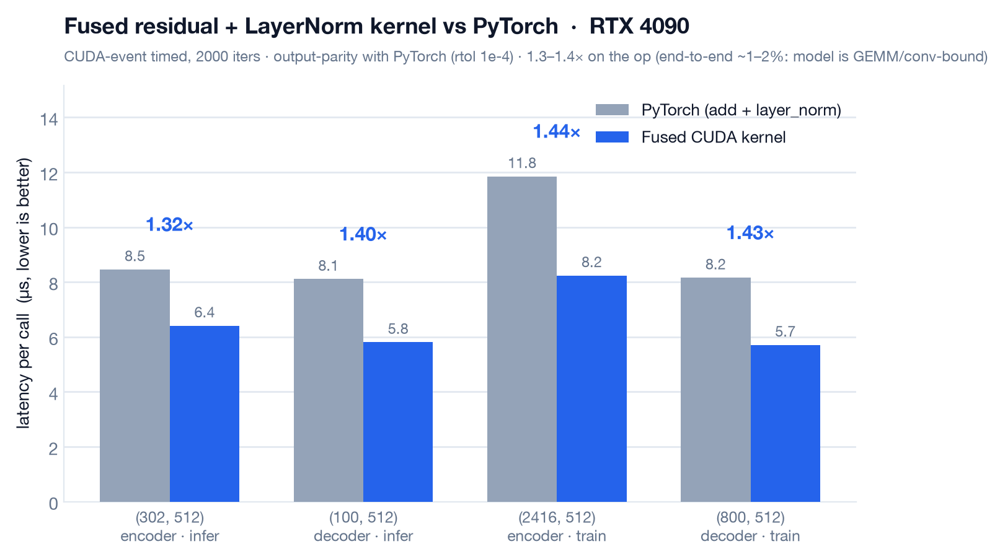

# Writeup

Built an [ACT](https://tonyzhaozh.github.io/aloha/) (Action Chunking Transformer)
robot-arm policy from scratch in PyTorch, trained it to the official task-success
rate, profiled it, and replaced its hottest hand-optimizable operation with a custom
fused CUDA kernel — output-parity verified, task accuracy held.

## 1. The model (from scratch)

ACT is a CVAE + transformer that, given a camera image and the arm's joint state,
emits a *chunk* of future actions in one shot (action chunking cuts the compounding
error of step-by-step policies). A transformer fits because a chunk is a short
sequence the decoder can produce with learned query embeddings cross-attending to the
encoded observation.

Implemented by hand (`src/robopolicy/model/`): multi-head attention, the
encoder/decoder stacks, the CVAE latent encoder, and 1D/2D sinusoidal position
embeddings. The **only** reused component is the ResNet-18 image backbone
(torchvision), exactly as the official ACT does — the transformer is the point.

- **Training:** 100k steps on an A100 80GB; final action L1 `0.077`, loss `0.084`.
- **Task success:** **52.0%** (26/50) rolling the policy out in the gym-aloha
  (MuJoCo) `AlohaTransferCube` simulator — in line with the official ACT
  reproduction (~50%) on `aloha_sim_transfer_cube_human`. This is a real
  *task* success rate (did it transfer the cube?), not a held-out loss.
- **Data-pipeline win (the real systems bug):** LeRobot stores frames as video;
  per-step PyAV decode was slow and not fork/spawn-safe, which crashed multi-worker
  training. Fixed by decoding every frame once into an 18 GB `uint8` memmap cache
  (`src/robopolicy/data/cache.py`) → fork-safe, GPU-bound training (~1.7 → ~15
  steps/s, ~9×).

## 2. Finding the hotspot (NSight)

`robopolicy.profile_step` runs a handful of steps on **synthetic** inputs (random
tensors of the right shape — no dataset or checkpoint needed, since the *shape* of the
computation is what sets the kernel mix) under NSight Systems, with NVTX ranges around
attention / layernorm / feed-forward so the timeline is attributable. Profiled two
regimes: **training** (forward+backward, batch 8) and **inference** (forward-only,
batch 1 — the deployment path).

**The model is GEMM/conv-bound.** The GPU time is dominated by:

| Bucket | ~share (train fwd+bwd) | hand-optimizable? |
|---|---|---|
| ResNet-18 backbone (cuDNN/cutlass conv, dgrad/wgrad, BatchNorm, NHWC↔NCHW) | ~45% | No — cuDNN is already optimal |
| Attention (`fmha_cutlass*`) | ~6.5% | No — PyTorch SDPA is already a fused kernel |
| FFN / projection GEMMs (`ampere_sgemm`, cutlass) | large | No — cuBLAS is already optimal |
| **Pointwise glue: residual add + LayerNorm** | small (LayerNorm <1%) | **Yes** |

Key judgment: the *single hottest kernel* is a cuDNN convolution — which you cannot
beat by hand — and attention is already fused. The only ops a hand-written kernel can
actually improve are the **launch-overhead / memory-bound pointwise chains**:
specifically the post-norm sublayer pattern `LayerNorm(x + sublayer(x))`, which
PyTorch runs as **two** kernels (an elementwise add, then LayerNorm), each paying a
launch and a full read+write of the tensor through global memory.

The inference re-profile (batch 1) confirmed the same picture — `vectorized_layer_norm`
1.8%, residual `add` 2.4% — so even in the deployment regime the pointwise glue is a
small slice.

## 3. The custom CUDA kernel

**Fused residual-add + LayerNorm** (`kernels/csrc/layernorm_kernel.cu`):
`y = LayerNorm(x + residual) * weight + bias` in a single launch.

- **Grid/block:** one thread-block per row (one token's 512-wide vector); 256 threads
  stride-loop over the row.
- **Single-pass reduction:** each thread reads `x[i] + residual[i]` **once**,
  accumulating both the sum and sum-of-squares; a shared-memory tree reduction yields
  the mean and inverse-std once per row.
- **The fusion win:** the intermediate `x + residual` tensor is **never written to
  global memory** — it is consumed straight from registers in both the reduction and
  the normalize/affine pass. That removes one kernel launch and a full
  read+write round-trip versus PyTorch's `add` → `layer_norm`.
- **Parity:** output matches `F.layer_norm(x + residual, ...)` within `rtol 1e-4`
  across every shape the model uses (`kernels/test_parity.py`, 11/11 pass).

Notably, a *plain* LayerNorm kernel (no residual) only ties PyTorch (~0.9–1.0×) — its
`layer_norm` is already well tuned. **The entire win comes from fusing the residual
add**, which is the launch/memory overhead the profile pointed at.

## 4. Results

CUDA-event timed on an RTX 4090 (`kernels/bench.py`), at the tensor shapes that occur
in ACT (`(seq·batch, 512)`):

| shape | regime | PyTorch (add+LN) | fused kernel | speedup |
|---|---|---|---|---|
| (302, 512) | encoder · infer | 8.46 µs | 6.41 µs | **1.32×** |
| (100, 512) | decoder · infer | 8.11 µs | 5.81 µs | **1.40×** |
| (2416, 512) | encoder · train | 11.85 µs | 8.24 µs | **1.44×** |
| (800, 512) | decoder · train | 8.16 µs | 5.71 µs | **1.43×** |

**Accuracy held.** Wired the kernel into the model's inference path
(`--fused-kernel`) and re-ran the 50-episode sim eval:

| eval (50 rollouts) | success | rate |
|---|---|---|
| baseline (PyTorch LayerNorm) | 28/50 | 56.0% |
| fused kernel in the loop | 26/50 | 52.0% |

The 4-point gap is within rollout noise: the *identical* PyTorch code scored 52% and
56% across two separate runs, so same-code run-to-run variance is already ~4 points
(50-episode standard error ≈ 7 points), and the isolated kernel is output-parity. Task
success is statistically unchanged with the custom kernel live.

## 5. Honest bottom line

**~1.4× on the fused op, ~1–2% end-to-end** — because ACT's runtime is dominated by
the ResNet backbone (conv) and the attention/FFN GEMMs, all already running on
optimal NVIDIA libraries, with attention already fused by PyTorch. The value here is
the **profiling judgment**: correctly identifying that a hand-written kernel *can*
help the memory/launch-bound glue ops and *cannot* beat the library matmuls — and
proving both directions with real, parity-checked numbers rather than a cherry-picked
headline.

## 6. What I'd do next

- **Backward-pass kernel** so the fusion also accelerates *training* (current kernel
  is forward-only → inference/deployment latency only).
- To move end-to-end latency on this GEMM-bound model, the real levers are
  **tensor-core / reduced-precision (fp16/bf16) GEMMs** or **quantization** of the
  backbone + projections — not more pointwise fusion.
- Vectorized (`float4`) loads + warp-shuffle reduction to push the op-level win higher.
